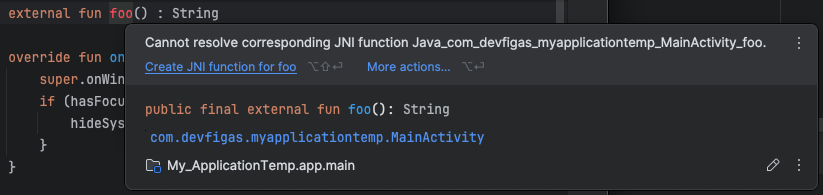

# Rust JNI

Although Android Studio does not offer robust support for Rust, this plugin provides a solid solution to integrate Rust with Android. Rather than reinventing the wheel, it replicates some of the conveniences that Android Studio offers when integrating Java with C++, but tailored for Rust.

## Requirements

| Requirement                                         | Min. Version |
|-----------------------------------------------------|--------------|
| [Rust](https://www.rust-lang.org/learn/get-started) | 1.79.0       |
| NDK (Tools -> SDK Manager -> SDK Tools -> NDK)      |              |

## Setup

### Import Plugin

**build.gradle.kts** (module level)
```kotlin
plugins {
    //...
    id("io.github.andrefigas.rustjni") version "<latest_version>"
}
```
Check the latest version [here](https://plugins.gradle.org/plugin/io.github.andrefigas.rustjni) (recommend) or maybe the [CHANGELOG.md](./doc/CHANGELOG.md) can help you to choose a version. 

### Configure architecture

**build.gradle.kts** (module level)
```kotlin
rustJni{
    rustPath = "./app/src/main/rust"
    ndkVersion = "25.2.9519653"
    architectures {
        armv7_linux_androideabi("armv7a-linux-androideabi21-clang")
        aarch64_linux_android("aarch64-linux-android21-clang")
        i686_linux_android("i686-linux-android21-clang")
        x86_64_linux_android("x86_64-linux-android21-clang")
    }
}
```
Here, you define the architectures you want to target when compiling your Rust code, along with the respective linkers.

You can find the available linkers in this directory:
```
<ndk.dir>/<ndkVersion>/toolchains/llvm/prebuilt/<prebuilt>/bin/
```
*The `<prebuilt>` folder will correspond to your OS, such as: linux-x86_64, linux-arm64, windows-x86_64, or darwin-x86_64.*

Let’s break down the sample argument:

```aarch64_linux_android("aarch64-linux-android21-clang")```

This configures the Rust library to be compiled for the `aarch64_linux_android` architecture using the `aarch64-linux-android21-clang` linker, targeting Android API level 21.

### How to create or compile a Rust library for Android?

Once the setup is finished, you only need to compile your project to ensure the Rust code is compiled before the Android code.


This will compile your Rust project. If you don't have one, a new project will be created here:
`app/src/main/rust/src/rust_jni.rs`

### How to link the Rust library with the Android project

Inform the plugin which Kotlin/Java class will load the Rust library.

```kotlin
rustJni{
    rustPath = "./app/src/main/rust"
    ndkVersion = "25.2.9519653"
    jniHost = "com.devfigas.rustjni.sample.MainActivity"
    architectures {
        armv7_linux_androideabi("armv7a-linux-androideabi21-clang")
        aarch64_linux_android("aarch64-linux-android21-clang")
        i686_linux_android("i686-linux-android21-clang")
        x86_64_linux_android("x86_64-linux-android21-clang")
    }
}
```

Compile your project again, and it will generate the JNI code for you.

```kotlin
class MainActivity : AppCompatActivity() {

    //<RustJNI>
    // auto-generated code
    // Checkout the source: rust/src/rust_jni.rs
    private external fun sayHello(): String

    init {
        System.loadLibrary("my_rust_lib")
    }
    //</RustJNI>

    override fun onCreate(savedInstanceState: Bundle?) {
        super.onCreate(savedInstanceState)
        setContentView(R.layout.activity_main)
        println(
            sayHello()
        )
    }

}
```
Check your console log for something like this:
```
 __________________________
 < Hello RustJNI >
 --------------------------
        \\
         \\
            _~^~^~_
        \\) /  o o  \\ (/
          '_   -   _'
          / '-----' \\
 _________________________________________________________
 Do your rust implementation there: app/src/main/rust/src/rust_jni.rs
 ---------------------------------------------------------
```

### How to generate Rust code ?

If you already used c++ in Android, you already saw something like this:


If you opt to use the use rust, there are a easier solution: It will be generated automatically when you compile your project:

You just have to:
- Make sure you filled the [jniHost](#how-to-link-the-rust-library-with-the-android-project) in the rustJni configuration
- Make sure your method follows that pattern:

**kotlin**
```kotlin
private external fun foo(): String
```

**java**
```java
private static native String foo();
```

- You code have to be placed between the comments `//<RustJNI>` and `//</RustJNI>`

```
//<RustJNI>
// auto-generated code

//<your methods here>

static { System.loadLibrary("my_rust_lib"); }

//</RustJNI>
```

### How to generate Java/Kotlin code ?

You can do the opposite, you can generate you JNI code first and let this plugin mirror it in your Kotlin/Java code.
You just have to follow same [instructions](#how-to-generate-rust-code) as above.

When you compile your project, the plugin will create those methods in your Kotlin/Java code.

Additionally, you may want to change the methods visibility:

- Visibility.PUBLIC
- Visibility.PRIVATE
- Visibility.PROTECTED
- Visibility.DEFAULT: this one will omit the this modifier and assume default visibility by programming language: Kotlin (**public**) and Java (**package-private**)

```kotlin
rustJni{
    //...
    jniMethodsVisibility = Visibility.PUBLIC
    //...
}
```

### How can I take a look at some samples?

- [Java](./sample/java) - A java sample with 1 method
- [Kotlin](./sample/java) - A java sample with 1 method
- [Game](./sample/game) - A simple game without any engine like cocos2d, just Rust and Android
